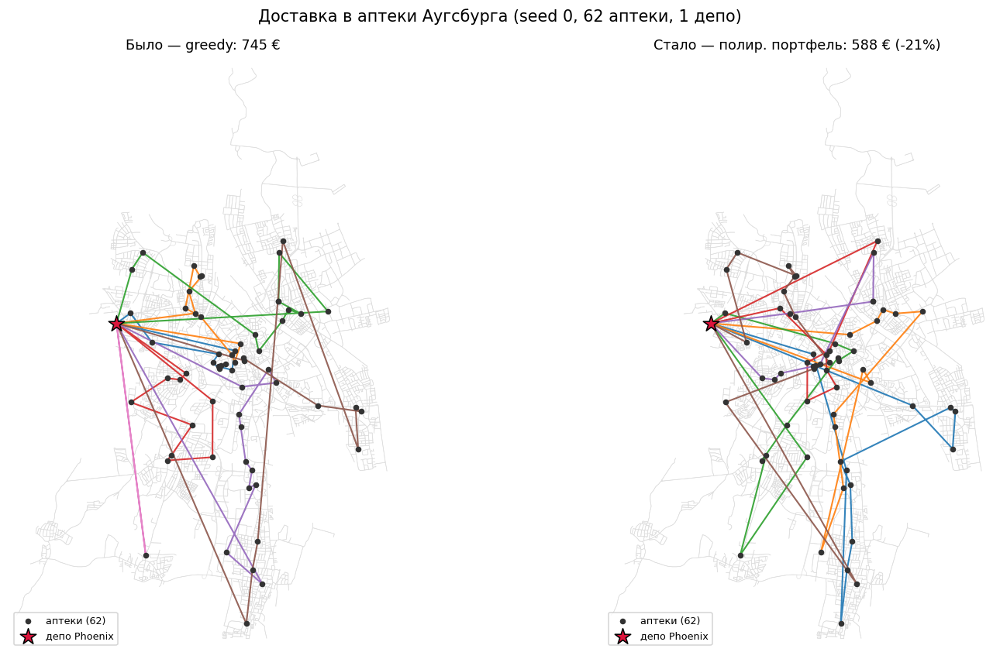
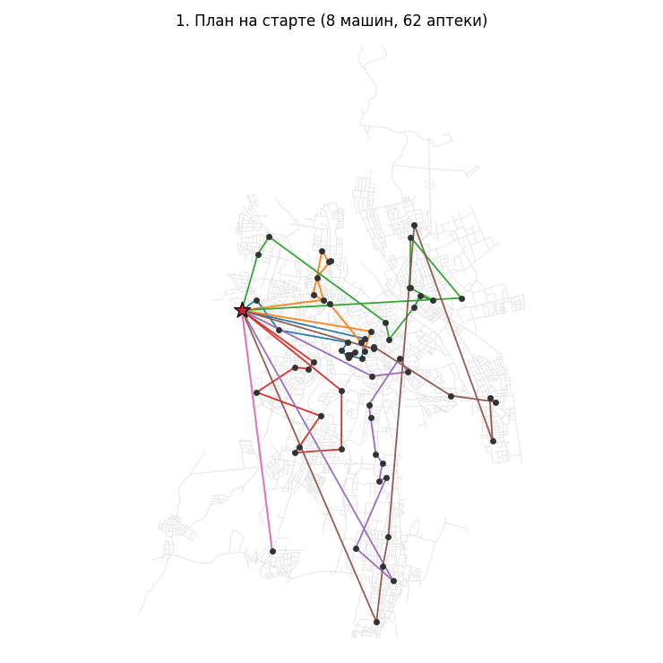
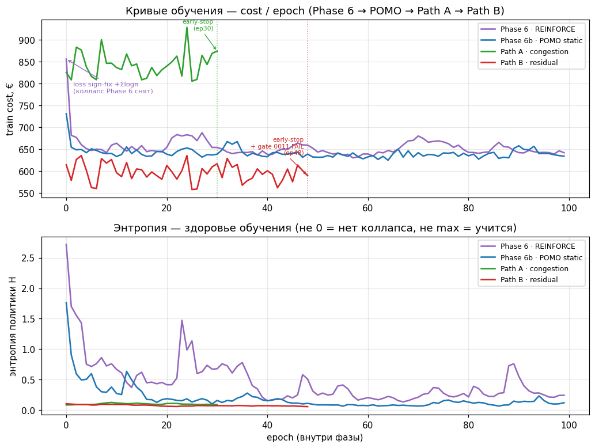
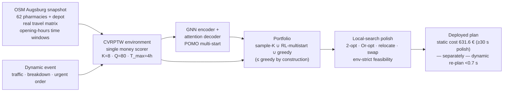

# Dynamic Pharmacy Delivery Routing — GNN + Reinforcement Learning on real Augsburg data

[](https://github.com/1987-Dmytro/logistics-rl-gnn/actions/workflows/ci.yml)


Online (event-driven) **Capacitated Vehicle Routing with Time Windows (CVRPTW)** for same-day
medication delivery to **62 pharmacies in Augsburg, Germany**, over the **real OpenStreetMap road
network** with real opening-hours time windows. A Graph-Neural-Network policy trained by
Reinforcement Learning (POMO) constructs routes; a candidate portfolio and a local-search polish
turn them into the deployed plan. When the world changes mid-day — traffic, a vehicle breakdown, an
urgent order — the system **re-plans in under 0.7 s**, versus **~2 s** for a from-scratch OR-Tools
re-solve.

> **Headline (all numbers from durable, seeded artifacts — see [Reproducibility](#reproducibility)):**
> **−23.5 % operating cost** vs the status-quo greedy heuristic, landing within **+3.4 %** of a
> strong static OR-Tools reference (30 s budget), and reacting to disruptions **~2.9× faster** than
> an OR-Tools re-solve.
>
> This README is deliberately honest about **what the neural policy does and does not buy** (see
> [What we learned](#what-we-learned)). Static solution *quality* is carried by classical
> local search, not by the GNN+RL policy; the durable RL contribution is **reaction latency** and
> **candidate diversity**, not beating OR-Tools on cost.

<p align="center">
  
</p>

| Traffic re-plan | Vehicle breakdown re-plan |
|:---:|:---:|
|  |  |

<p align="center">
  
</p>

---

## Demo

One command narrates the whole system on real Augsburg data — build the plan, inject a mid-day
event, react — with every number pulled from the same scorer (no new math, static and dynamic
worlds kept apart):

```bash
python scripts/demo.py --seed 0 --event traffic   # or: breakdown | urgent
```

```text
Model:    results/policy_pomo_congestion.pt · sha256 24c8cfb0607235f8… (== provenance of results/system_metrics.json ✓)
Trained:  2026-07-22 · 6b-step2-congestion-training · summary results/pomo_congestion_summary.json

[1/5] Morning, Tuesday 08:00. PHOENIX depot, Benzstraße 10, 86391 Stadtbergen.
      Orders: 62 pharmacies, 476 boxes. Fleet K=8, capacity Q=80, T_max=4 h.
[2/5] Building the plan… (portfolio + local-search polish)
      portfolio candidates — the day plan (one scorer; EVERY candidate gets polish):
        source                   n     best €     mean €  +polish €
        greedy heuristic         1      744.7      744.7      640.6
        RL multistart            1      698.9      698.9      616.2
        RL sample-K            128      743.8      764.1      587.9  ← chosen
      → 6 vehicles, 168.5 km, on-time 100% · 587.9 € (parity with system_metrics per_seed[0] ✓)
[3/5] 08:52 — EVENT (traffic):
      jam/incident near pharmacy 'Tattenbach Apotheke' (radius 1.2 km, closure (∞)).
      2 undelivered stops are in the zone, vehicles affected: [5, 6].
[4/5] Re-plan from the current state (48 stops remaining)…
      A do-nothing (drive the old plan): 578.7 € · unserved 0 · on-time 100 %
      B OR-Tools re-solve (budget 2 s): 826.5 € · unserved 2 · on-time 100 % · durable median 2001 ms
      G greedy re-plan (heuristic, no ML): 516.6 € · unserved 0 · on-time 100 % · durable median 7 ms
      C system (portfolio+polish): 495.9 € · unserved 0 · on-time 100 % · durable median 689 ms
      → Two comparisons, do not merge them. (1) vs OR-Tools: comparable price at a ×2.9 faster
        reaction — OR has not converged in the reaction budget (~30 s needed); at a full ~30 s
        budget OR-Tools WINS on quality (dec-0013). (2) vs the greedy re-plan: −20.7 € on this
        event (durable median −16.8 €/event over 25 events, never worse by construction) — bought
        at ~96× greedy's reaction time (689 ms vs 7 ms). On THIS event the portfolio winner WAS
        the greedy candidate: that delta is local-search polish, not the model.
[5/5] Day outcome (the remainder under congestion+event — ANOTHER world):
      • without a re-plan (do-nothing): 578.7 €
      • after re-plan (system): 495.9 € (Δ -82.8 €)   • on-time 100% · unserved 0
      This run's model contribution (portfolio WITHOUT RL candidates vs with them):
        • day plan: without the model 640.6 € · with it 587.9 € → -52.7 € (-8.2 %)
        • re-plan  : without the model 490.1 € · with it 495.9 € → +5.8 € (+1.2 %)
```

<sub>Abridged from a real run (the tool also prints per-run wall-clock next to each durable median,
the re-plan's own candidate table, and the artifact paths). **B's total jitters** with OR-Tools'
GLS wall-clock (826.5–826.7 € across runs); the stable part is the **2 unserved stops → 400 €
penalty** inside that total. The last block is the point of `--no-model`: on this event the model
costs **+5.8 €**, reproducing the durable Path-B verdict in a single run.</sub>

Five self-describing artifacts land in `demo_out/` (git-ignored): **`1_morning_plan.html`** (static
free-flow day), `route_sheet.md`, **`2_incident_no_replan.html`** (drive the old plan through the
closure), **`3_incident_replan.html`** (our re-plan — old plan a toggleable dashed layer, jam zone in
red), and **`compare.html`** — the screencast frame: maps #2 | #3 side-by-side with the A/B/G/C table.
Every map hop follows real streets (`nx.shortest_path` over the OSM graph, cached). Header prices come
from the run's scorer; the ×2.9 comes from durable medians in
[`0009`](knowledge/decisions/0009-phase6b-local-search-polish.md), not that run's wall-clock.

The frame is built to resist a flattering reading: the **greedy re-plan is a row, not a footnote**
(it is the realistic no-ML reaction, and on events where greedy wins the portfolio it lands close to
the system); every row carries **unserved** and **on-time %**, and any unserved penalty is named
inside the cost (`826.5 € (incl. 400 € unserved penalty)`); **OR-Tools is marked budget-capped** —
at its full ~30 s budget it beats the system on static quality
([`0013`](knowledge/decisions/0013-time-matched-benchmark.md)); and the **durable 25-event context**
sits under the table so one event is never read as the general case.

Every run opens with a **provenance banner** (checkpoint path · sha256 · training date · decision
record) and hard-fails if that sha does not match the provenance of the durable summary the printed
numbers come from — missing weights stop the run instead of silently falling back to a heuristic.
Steps `[2/5]` and `[4/5]` print the portfolio's **candidate table** (source → cost → who won → after
polish), and `--no-model` runs the same portfolio *without* RL candidates so the model's contribution
for that run is a measured number, not a claim.

### Custom scenarios

`--scenario` describes any dispatcher's day on the same real data: weekday (time windows come from
the pharmacies' real `opening_hours` for that day, plus the `c(dow,h)` congestion profile), the
subset of pharmacies (names are fuzzy-matched against the snapshot, or use stop-ids / `all`), demand
overrides, fleet `K`/`Q`, and the event chain. Same pipeline, same renders, same guards
(`Σdemand ≤ K·Q`, reachability in `T_max`). Without the flag the default Tuesday run is unchanged.

> The policy was trained on Tuesday only (`dow = 1`: Tuesday windows and profile; episodes varied the
> dispatch hour, incidents and `n`, never the weekday). Mon–Fri share the same `c(dow,h)` amplitude,
> so weekday scenarios differ from training only in the opening-hours windows; Sat/Sun (amplitude
> 0.7/0.5) are out of distribution. Either way the RL start is only a *candidate* — the portfolio
> takes the best of `{greedy, RL-multistart, sample-K}` under one scorer, so a scenario the policy
> generalizes poorly to is fenced by the greedy baseline, never worse than it.

```bash
python scripts/demo.py --scenario scenarios/friday_south.yaml --no-open   # subset, 2 vehicles
python scripts/demo.py --scenario scenarios/monday_rush.yaml  --no-open   # all 62, double jam
```

```yaml
name: friday_south            # scenarios/friday_south.yaml
weekday: friday               # 0..6 or monday..sunday
dispatch_start: "08:00"
pharmacies: [Vita-Apotheke, Bergius-Apotheke, Lotos-Apotheke]   # names / stop-ids / all
demand: {Vita-Apotheke: 14}   # boxes, overrides the seeded draw
fleet: {K: 2, Q: 80}
events:
  - {at: "08:50", type: traffic, where: Vita-Apotheke,          # breakdown | urgent
     params: {magnitude: 1.6, radius_km: 1.5, duration_min: 45}}   # closure: true → δ=∞
```

---

## Problem

- **Fleet:** `K = 8` vehicles, capacity `Q = 80`, max tour `T_max = 4 h` (multi-tour + EU 561/2006
  driving-time rationale).
- **Demand:** 62 real Augsburg pharmacies + 1 depot; per-stop demand in `[3, 12]`; time windows
  derived from **real OSM `opening_hours`** where available (`REAL`), seeded synthetic fallback
  otherwise (`ASSUMED`) — every stop is tagged (real and synthetic are never silently mixed).
- **Travel:** an **asymmetric, non-Euclidean** OSRM-style travel-time matrix on the real road graph
  (so no Euclidean data augmentation — a rotation would falsify travel times).
- **Dynamics:** mid-day events (congestion, breakdown, urgent order) trigger a re-plan on the
  *residual* problem; the objective is a single money-valued cost combining distance, duty time,
  fixed vehicle cost, and an unserved-customer penalty, computed by **one shared scorer**
  (`env/scoring.py:evaluate_solution`) used identically for the environment, the baselines, and the
  policy.

## Architecture



> Two settings, never one point: the **631.6 €** is the *static* daily plan (reached with ≥30 s of
> polish); the **&lt;0.7 s** is the *dynamic* re-plan latency on a smaller residual problem. They are
> different measurements and are kept apart throughout this README.

Each layer's honest contribution (static, full-62, seeds 0–9):

| Layer | Role | Measured contribution |
|---|---|---|
| **OSM snapshot** | Real Augsburg graph, 62 pharmacies, real opening-hours windows | Data foundation; makes the case "real data", not synthetic |
| **GNN + RL (POMO)** | Neural multi-start route constructor | Best RL static start **770.4 €** (−6.7 % vs greedy) — but **after polish it is +1.0 % *worse* than a greedy start**; RL is not the quality lever |
| **Portfolio** | `sample-K ∪ RL-multistart ∪ greedy`, byte-identical greedy candidate | **≥ greedy on 25/25 events** by construction; sample-K adds **−2.45 %** over plain multistart (candidate diversity) |
| **Local-search polish** | 2-opt / Or-opt / relocate / swap, full-eval under time-dependent travel | **Dominant lever:** −21 % on a greedy start; portfolio **766.1 € → 631.6 €** (−17.6 %) |
| **Deployed** | Polished portfolio | **631.6 €** static (+3.4 % vs OR-Tools); **~689 ms** dynamic re-plan latency |

<sub>Intermediate figures trace to decisions: 770.4 € RL static best → [0006](knowledge/decisions/0006-pomo-static.md);
sample-K −2.45 % over multistart → [0008](knowledge/decisions/0008-phase6b-inference-search.md);
polish −21 % / portfolio 766.1 → 631.6 € and the +1.0 % post-polish RL gap →
[0009](knowledge/decisions/0009-phase6b-local-search-polish.md).</sub>

## Results

All numbers come from seeded runs recorded in `results/*.json`; the tables below are regenerated by
one script (`scripts/final_metrics.py`) and mirrored in [`docs/final_metrics.md`](docs/final_metrics.md).

### Static — before / after (Augsburg, seeds 0–9, full-62, free-flow, single scorer)

Greedy is the status-quo "before"; the polished-portfolio "system" is the "after"; OR-Tools (30 s) is
the upper-bound reference — **not** the "after".

| Metric | greedy (before) | OR-Tools (30 s) | **System (after)** | Δ vs greedy | Δ vs OR-Tools |
|---|---:|---:|---:|---:|---:|
| Operating cost, € | 825.4 | 611.1 | **631.6** | **−23.5 %** | +3.4 % |
| Distance, km (fuel proxy) | 158.8 | 144.7 | **157.3** | −1.0 % | — |
| Vehicle-hours on duty\* | 19.3 | 11.2 | **11.6** | **−39.6 %** | — |
| Vehicles used | 7.2 | 6.3 | **6.4** | −11.1 % | — |
| On-time, % | 100 | 100 | 100 | — | — |
| Unserved | 0.0 | 0.0 | 0.0 | — | — |

\* Vehicle-hours = driving + idle waiting for time windows + service. The −39.6 % win is **almost
entirely reduced idle/window waiting**, not driving — distance is ~flat (−1.0 %) and service is
identical (same 62 pharmacies). It is a saving of **duty hours (labor)**, not kilometers.

### Time-matched — give OR-Tools the same wall-clock (static, seeds 0–9)

The static "after" (631.6 €) is reached with **≥30 s** of polish. The honest question is: what does
OR-Tools do with the *same* budget on the *same* instances? Because the seeds are shared, we report
**paired** win-counts and median per-seed Δ (cross-seed difficulty cancels), not an unpaired σ.

| OR-Tools budget | cost, € (±std) | wins/10 vs system | median Δ/seed |
|---|---:|---:|---:|
| 0.7 s | 629.7 ± 44 | 6/10 | −4.9 € |
| 2 s | 626.1 ± 42 | 7/10 | −10.5 € |
| 5 s | 625.0 ± 42 | 7/10 | −11.2 € |
| 30 s | 610.5 ± 39 | **8/10** | **−18.6 €** |

**Read this honestly:** given equal time, OR-Tools reaches the system's static quality within **<1 s**
(6/10) and clearly **beats** it by 30 s (8/10, median −18.6 €/seed). The system has **no** static
advantage — in quality or in latency. (The 30 s point 610.5 € matches the 611.1 € baseline within
GLS wall-clock jitter.)

### Dynamic — where the system actually wins (re-plan on residual events, n=25)

This is a **different setting** from the static tables above: a mid-day event leaves a smaller
*residual* problem, and we measure reaction latency and cost there. Residual costs (~827–867 €) are
**not** comparable to the static 631.6 €.

| Re-plan system | latency (median) | cost, € | unserved |
|---|---:|---:|---:|
| greedy | 7 ms | 851.5 | 2.0 |
| **System** (portfolio + polish) | **689 ms** | 827.3 | 2.0 |
| OR-Tools re-solve | 2001 ms | 866.9 | 2.5 |

The portfolio is **never worse than greedy** (0/25 violations, median −16.8 € cheaper), reacts
**~2.9× faster than OR-Tools** at comparable quality, and the raw neural forward-pass floor is ~18 ms
(quality-inferior on its own — see below). **This dynamic reaction latency is the one durable edge of
the GNN+RL layer.**

### Example route plan

The exact plan behind these numbers is emitted as a human-readable **route sheet**
(`scripts/route_sheet.py`), whose cost is parity-asserted against `system_metrics` per-seed — it
describes *precisely* the plan in the tables above. For seed 0 (Tuesday, 62 real pharmacies, depot
PHOENIX Benzstraße 10) the system dispatches **6 of 8 vehicles**, 476 boxes, 168.5 km, **587.9 €**.
Vehicle 1 (real OSM pharmacy names, arrivals honoring real `opening_hours` windows):

| # | Pharmacy | Arrival | Window | Load |
|---:|:--|:--:|:--:|---:|
| 1 | DrKraus Apotheke am diako | 08:03 | 08:00–18:00 | 9 |
| 2 | APEX Vital | 08:13 | 08:00–18:00 | 12 |
| 3 | Gisela Apotheke | 08:24 | 08:00–13:34 | 23 |
| … | … | … | … | 80 → depot 09:30 |

Full per-vehicle timeline + a dynamic re-plan diff (mid-day traffic event, seed 0) is in
**[`docs/route_sheet.md`](docs/route_sheet.md)**.

## What we learned

This project is a **negative result reported honestly**, plus a precise account of where the neural
machinery does help. The methodology was designed to make the verdict hard to fake.

**The headline negative result — RL-alone does *not* beat classical methods on quality at 62 stops.**
Two independent failure modes, proven separately:
- *At convergence it only reaches parity.* After local-search polish, every constructor start
  collapses into ~650–659 € (greedy 652.2, RL 658.9, sample-K 650.9); the RL start is **+1.0 %
  *worse*** than a greedy start. The quality comes from classical local search, reachable from a
  plain greedy start. ([decision 0009](knowledge/decisions/0009-phase6b-local-search-polish.md))
- *Under a tight real-time budget it loses.* The achievable single-decode RL start is 865.5 € vs
  greedy 851.5 € (wins only 6/25) and is *slower* (18 ms vs 7 ms), so it steals its own polish
  budget — there is no latency niche for it. ([decision 0010](knowledge/decisions/0010-phase6b-ablation-latency-niche.md))

**The verdict was pre-registered.** The final "RL-by-quality" test was a **gate committed to git in a
separate commit *before* the training code** — `median Δ(rl−greedy) < 0 € AND wins > 12/25`, one run,
no retry, kill-criteria fixed in advance. The git timestamp guarantees the target was not fitted to
the result. It **failed** (median +14.84 €, 7/25), with no retry, closing the thesis on real data.
([0011 pre-registration](knowledge/decisions/0011-pathB-residual-curriculum-prereg.md) →
[0012 verdict](knowledge/decisions/0012-pathB-residual-verdict.md))

**The comparisons are paired and adversarial.** Per-event median-Δ + win-counts on identical seeds
(so instance difficulty cancels); a byte-identical greedy candidate that makes "portfolio ≤ greedy"
true *by construction* rather than by trusting the net; env-strict feasibility in the polish (a
5-lens adversarial review caught a real `T_max`-return feasibility bug); and a time-matched benchmark
that removes the "we compared against an under-budgeted OR-Tools" objection.
([0008](knowledge/decisions/0008-phase6b-inference-search.md),
[0013](knowledge/decisions/0013-time-matched-benchmark.md))

**Where GNN+RL genuinely contributes:**
1. **Instant reaction latency vs OR-Tools** — 689 ms re-plan / ~18 ms raw neural floor vs OR-Tools
   2001 ms. This is an edge **vs OR-Tools**, not vs greedy (greedy is both faster and a better
   start), and it is the only edge that survives time-matched benchmarking. The policy was first
   adapted to live congestion (Path A, [decision 0007](knowledge/decisions/0007-phase6b-congestion-training.md))
   before the residual Path B was pre-registered.
2. **Candidate diversity** — sample-K adds −2.45 % over plain multistart, and the RL rollout is a
   useful anytime candidate whose worst case is fenced by the greedy candidate.

**Enabling training-stability lesson.** Early training collapsed to an all-depot solution (`|g|→0`,
`p=nan` baseline deadlock). The cure: **drop the `C·tanh` logit clip** (it saturated gradients) and
**std-normalize the advantage**, plus runtime freeze/entropy guards so a silent collapse can never
reach a published number. POMO's non-degenerate shared multi-start baseline then keeps
mean-centering while dropping std-norm.
([decision 0003](knowledge/decisions/0003-phase6-training.md))

## Reproducibility

Reproducibility is a project goal, enforced by hard rules: **no metric leaves the repo without a
fixed seed + saved config**, greedy and OR-Tools use an **identical instance + shared scorer**, and
heavy artifacts (weights, snapshots, result JSONs) stay **out of git**.

**1. Install (CPU-only).** Runtime deps are grouped; base install is dependency-free.

```bash
pip install -e ".[dev,data,env,baselines,viz]"
# neural policy (optional, CPU wheels):
pip install torch --index-url https://download.pytorch.org/whl/cpu
pip install -e ".[model]"
```

**2. Build the real Augsburg snapshot** (pulls OSM once → `data/snapshots/augsburg_<date>/`; kept out
of git, moved to a training server via `rsync` per [`knowledge/runbooks/train-on-server.md`](knowledge/runbooks/train-on-server.md)):

```bash
python scripts/build_snapshot.py
```

**3. Regenerate each table with one script** (writes gitignored `results/*.json`; every script logs
seed + config + library versions + checkpoint sha):

| Artifact / table | Command |
|---|---|
| Baselines (greedy, OR-Tools) | `python scripts/run_baselines.py` → `results/baselines.json` |
| System full vector (parity-guarded 631.6 €) | `python scripts/eval_system.py` → `results/system_metrics.json` |
| Local-search polish + re-plan latency | `python scripts/run_polish.py` → `results/polish_summary.json` |
| Latency-niche ablation | `python scripts/run_ablation.py` → `results/ablation_summary.json` |
| Time-matched anytime curve | `python scripts/run_timematch.py` → `results/timematch.json` |
| **Final tables (static + time-matched)** | `python scripts/final_metrics.py` → [`docs/final_metrics.md`](docs/final_metrics.md) |
| Figures (map, GIFs, curves) | `python scripts/viz_routes.py` · `viz_replan.py` · `viz_training.py` |

`final_metrics.py` **asserts parity anchors** (greedy 825.38, OR-Tools 611.14, system 631.62); a
drifted artifact fails the assert instead of silently mis-reporting.

**4. Tests.**

```bash
pytest        # snapshot / OR-Tools / torch tests self-skip when those optionals are absent
ruff check src scripts tests
```

## Limitations & future work

- **`simulated-on-real` congestion.** Traffic is a simulated multiplier `c(class, dow, hour)` layered
  on the *real* travel matrix — tagged as such, never presented as measured traffic. *Production
  path:* swap the multiplier for real per-segment speed profiles behind the existing `TravelModel`
  interface, keeping the rest of the pipeline unchanged.
- **FIFO travel simplification.** Time-dependent travel assumes FIFO (no overtaking); fine for the
  current resolution, but real signal-level dynamics would need a finer model.
- **Cold-chain backlog not modeled.** Refrigerated items that miss a window are counted as unserved,
  not queued into a next-tour backlog with spoilage cost.
- **No demand forecast.** Demand is drawn per instance; a time-series forecast of order arrivals
  would let the planner pre-position capacity instead of purely reacting.
- **Deployment shape.** Given the honest findings, the useful role for GNN+RL is a **latency layer**
  (an instant anytime candidate inside the portfolio) — quality is carried by multistart + polish,
  not by the policy.

## Repository layout

```
src/logistics_rl_gnn/   env · models (GNN+attention) · train (POMO) · baselines (greedy, OR-Tools) · replan (portfolio, polish) · data (OSM) · config/scenario (YAML days)
scripts/                run_* (experiments) · viz_* (figures) · build_snapshot · final_metrics
scenarios/              custom dispatcher days (YAML) consumed by `demo.py --scenario`
tests/                  pytest suite (self-skips without snapshot/ortools/torch)
knowledge/decisions/    numbered decision records (0001–0013) — the honest audit trail
docs/                   final_metrics.md · assets/ (committed figures)
```

Heavy artifacts (`*.pt` weights, `data/snapshots/`, `results/*.json`, logs, the interactive
`docs/routes_map_after.html`) are intentionally **not** tracked — code and configs only.

## License & citation

MIT — see [`LICENSE`](LICENSE). If this work is useful, please cite the repository:

```bibtex
@software{gordiyenko_logistics_rl_gnn,
  author  = {Gordiyenko, Dmytro},
  title   = {Dynamic Pharmacy Delivery Routing with GNN + Reinforcement Learning},
  year    = {2026},
  url      = {https://github.com/1987-Dmytro/logistics-rl-gnn}
}
```
